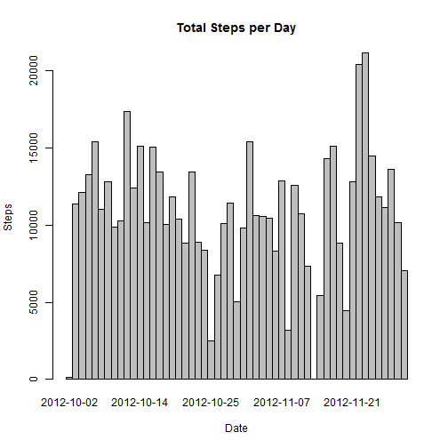
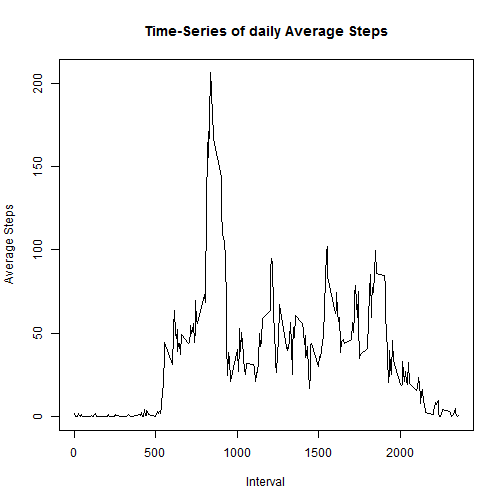
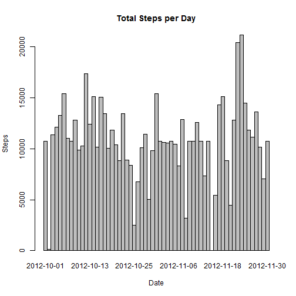
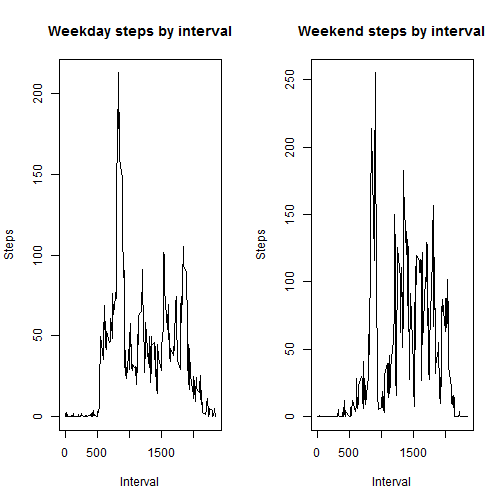

## Loading and preprocessing the data

Show any code that is needed to 

1. Load the data (i.e. read.csv())

2. Process/transform the data (if necessary) into a format suitable for your analysis


```r
##
## Activity.csv should be in the R work directory
##
## Read csv file
f <- read.csv("activity.csv")
## omitted NA values
fwithoutna <- f[!is.na(f$steps),]
fsub <- data.frame(fwithoutna$date,fwithoutna$steps)
names(fsub) <- c("date", "steps")
```

## What is mean total number of steps taken per day?

For this part of the assignment, you can ignore the missing values in the dataset.

1. Make a histogram of the total number of steps taken each day

2. Calculate and report the mean and median total number of steps taken per day


```r
## sum
agg_sum <- aggregate(fsub$steps,list(fsub$date),sum)
## plot sum
barplot(
    height=agg_sum$x,
    main="Total Steps per Day",
    xlab="Date",
    ylab="Steps",
    names.arg=agg_sum$Group.1,
    space=c(0)
)
```



```r
## mean
agg_mean <- aggregate(fsub$steps,list(fsub$date),mean)
steps_mean <- mean(agg_sum$x)
print(steps_mean)
```

```
## [1] 10766.19
```

```r
## median
steps_median <- median(agg_sum$x)
print(steps_median)
```

```
## [1] 10765
```

## What is the average daily activity pattern?

1. Make a time series plot (i.e. type = "l") of the 5-minute interval (x-axis) and the average number of steps taken, averaged across all days (y-axis)

2. Which 5-minute interval, on average across all the days in the dataset, contains the maximum number of steps?

```r
##
fsub2 <- data.frame(fwithoutna$interval,fwithoutna$steps)
names(fsub2) <- c("interval","steps")
## aggregate interval mean
agg_stepsinterval <- aggregate(fsub2$steps,list(fsub2$interval),mean)
plot(
    x=agg_stepsinterval$Group.1,
    y=agg_stepsinterval$x,
    type="l",
    main="Time-Series of daily Average Steps",
    xlab="Interval",
    ylab="Average Steps"
)
```



## Imputing missing values

Note that there are a number of days/intervals where there are missing values (coded as NA). The presence of missing days may introduce bias into some calculations or summaries of the data.

1. Calculate and report the total number of missing values in the dataset (i.e. the total number of rows with NAs)

2. Devise a strategy for filling in all of the missing values in the dataset. The strategy does not need to be sophisticated. For example, you could use the mean/median for that day, or the mean for that 5-minute interval, etc.

3. Create a new dataset that is equal to the original dataset but with the missing data filled in.

4. Make a histogram of the total number of steps taken each day and Calculate and report the mean and median total number of steps taken per day. Do these values differ from the estimates from the first part of the assignment? What is the impact of imputing missing data on the estimates of the total daily number of steps?


```r
## calculate NAs
fisna <- f[is.na(f$steps),]
length(fisna$steps)
```

```
## [1] 2304
```

```r
## transform a new variable to contain the interval average step instead of the NA values
ftrans <- f
for( counter in 1:length(f$steps) ){
    if(is.na(f$steps[counter])){
        newsteps <-
            agg_stepsinterval[agg_stepsinterval$Group.1 == f$interval[counter],]$x    
        ftrans$steps[counter] <- newsteps
    }
}
## without missing values
agg_sumall <- aggregate(ftrans$steps,list(ftrans$date),sum)
##plot it
barplot(
    height=agg_sumall$x,
    main="Total Steps per Day",
    xlab="Date",
    ylab="Steps",
    names.arg=agg_sumall$Group.1,
    space=c(0)
)
```



```r
## mean for all values
steps_meanall <- mean(agg_sumall$x)
print(steps_meanall)
```

```
## [1] 10766.19
```

```r
## median for all values
steps_medianall <- median(agg_sumall$x)
print(steps_medianall)
```

```
## [1] 10766.19
```

## Are there differences in activity patterns between weekdays and weekends?

For this part the weekdays() function may be of some help here. Use the dataset with the filled-in missing values for this part.

1. Create a new factor variable in the dataset with two levels – “weekday” and “weekend” indicating whether a given date is a weekday or weekend day.

2. Make a panel plot containing a time series plot (i.e. type = "l") of the 5-minute interval (x-axis) and the average number of steps taken, averaged across all weekday days or weekend days (y-axis). The plot should look something like the following, which was creating using simulated data:
Your plot will look different from the one above because you will be using the activity monitor data. Note that the above plot was made using the lattice system but you can make the same version of the plot using any plotting system you choose.


```r
## 
fweekdays <- data.frame(ftrans$steps,ftrans$date, ftrans$interval, c(1:length(ftrans$steps)) )
names(fweekdays )<-c("steps","date","interval","weekday")

for( counter in 1:length(fweekdays$steps) ){
    
    currday <- weekdays(as.Date(fweekdays$date[counter]))
    
    if(currday == "szombat" || currday == "vasárnap" 
       || currday == "saturday" || currday == "sunday"){
        fweekdays$weekday[counter] <- 0
    }else{
        fweekdays$weekday[counter] <- 1
    }
}

## filtered variables 
fweek0 <- fweekdays[fweekdays$weekday == 0,]
fweek1 <- fweekdays[fweekdays$weekday == 1,]
## plot 2 beside each other
par(mfrow=c(1,2))
## weekdays
agg_fweek1 <- aggregate(fweek1$steps,list(fweek1$interval),mean)
plot(
    x=agg_fweek1$Group.1,
    y=agg_fweek1$x,
    type="l",
    main="Weekday steps by interval",
    xlab="Interval",
    ylab="Steps"
)
## weekend
agg_fweek0 <- aggregate(fweek0$steps,list(fweek0$interval),mean)
plot(
    x=agg_fweek0$Group.1,
    y=agg_fweek0$x,
    type="l",
    main="Weekend steps by interval",
    xlab="Interval",
    ylab="Steps"
)
```



